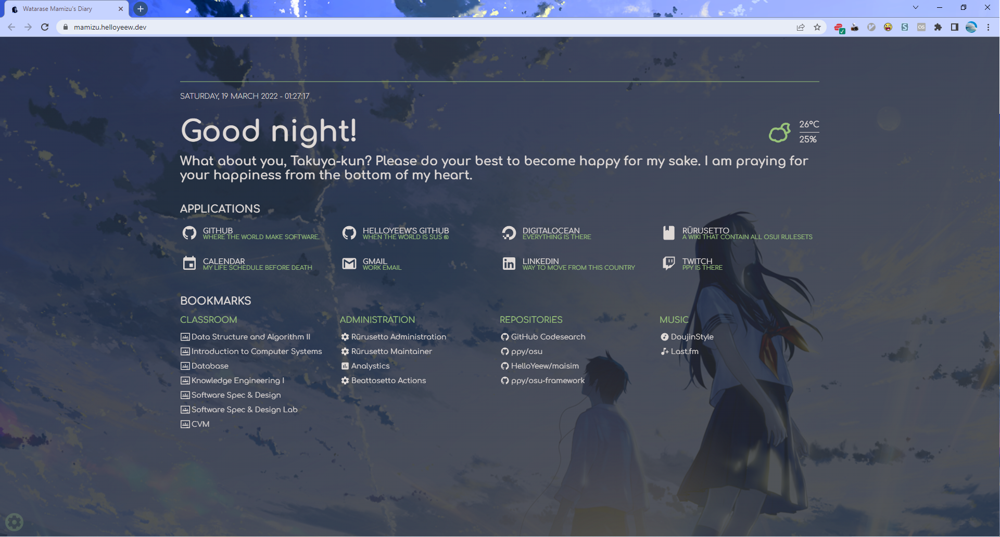
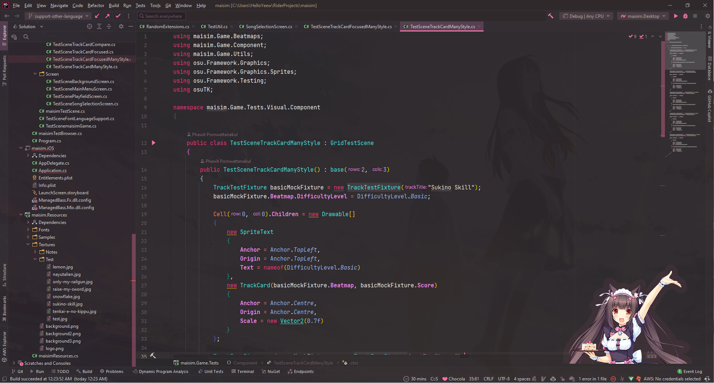

# HelloYeew's workflow setup

Here's the list of tool and setup that I use in my workflow.

## Note on my setup

Note that I work on many platform :
- MacOS (MacBook Pro) for all development, testing and when not working at home.
- Windows (PC) with Linux virtual machine for .NET development and testing stuff too. When I'm working at home I usually use this.
- iPad (iPad Pro) for speedy PR check and some urgent SSH connection.

That's why I try to make almost of every tool sync between these three devices so if some tool is only support on specific platform, I will note on it.

## Browser

I normally use [Google Chrome](https://www.google.com/chrome/) as a primary browser since I use it for a long time and it's good for web development. (I use [Microsoft Edge](https://www.microsoft.com/en-us/windows/microsoft-edge) too but not much. Just use it as a test browser)

### Theme

I use theme that I create from [loundraw's illustration from 君は月夜に光り輝く](https://www.pixiv.net/en/artworks/61606801) with my personal customized color.

Download : [You Shine in the Moonlit Night](theme/You-Shine-in-the-Moonlit-Night.crx)

**Old theme that I create and use before:**
- [[Sakura Memories] Kasumi Toyama](theme/[Sakura Memories]-Kasumi-Toyama.crx)
- [Evening Lonely Girl](theme/Evening-Lonely-Girl.crx)

### Homepage

As you see from the theme preview image, I use my customized self-host homepage since I want to use this homepage on every device.

- [mamizu](https://github.com/HelloYeew/mamizu) : Fork of [Flame](https://github.com/pawelmalak/flame) that I add some of my customization to make it looking same as my theme and some of my personal customization like wallpaper or font.
- [Custom New Tab URL](https://chrome.google.com/webstore/detail/custom-new-tab-url/mmjbdbjnoablegbkcklggeknkfcjkjia) : Without this extension I cannot set mamizu as my chrome homepage.

### Plugin & Extension

**Useful GitHub related tool:**

- [GitHub Red Issues](https://chrome.google.com/webstore/detail/github-red-issues/kjbbjibfgnnfdeabgmbieapkhpojikpc) : This extension make your closed issues no more disgusting purple like merged PR color.
- [GitHub Issues Link Status](https://chrome.google.com/webstore/detail/github-issue-link-status/nbiddhncecgemgccalnoanpnenalmkic) : Show issues or PR status on GitHub so you don't have to click on the issues or PR to see its status.
- [GitHub Hovercard](https://chrome.google.com/webstore/detail/github-hovercard/mmoahbbnojgkclgceahhakhnccimnplk) : Just hover your mouse to all link in GitHub and you can glancing some short information like profile, PR detail or issues detail.

**More pretty cool extensions:**

- [Vimium](https://chrome.google.com/webstore/detail/vimium/dbepggeogbaibhgnhhndojpepiihcmeb) : Make your browser like Vim by add some feature that's like Vim so you can use your browser with your keyboard and use some of pretty useful keybind feature.
- [Web Scrobbler](https://chrome.google.com/webstore/detail/web-scrobbler/hhinaapppaileiechjoiifaancjggfjm) : Integrate your chrome with last.fm
- [Screenshot YouTube](https://chrome.google.com/webstore/detail/screenshot-youtube/gjoijpfmdhbjkkgnmahganhoinjjpohk) : Make your screenshot from YouTube more pretty and high resolution.

## IDE

I normally use JetBrain platform as a primary IDE and [Visual Studio Code](https://code.visualstudio.com/) as a secondary IDE. Here's my IDE that I use.

- [PyCharm Professional](https://www.jetbrains.com/pycharm/) : Use in Python development and some web development that use Python framework like [Django](https://www.djangoproject.com/) since it's fully support on Django and have a lot of useful features to make your development process easier.
- [dotUltimate](https://www.jetbrains.com/dotnet/) ([Rider](https://jetbrains.com/rider/) and [ReSharper Tool](https://jetbrains)) : Use in .NET and entire C# project development. It's a best IDE for .NET development for me. The code recommendation and refactoring tool is really good and with its tool it's best for spectate your .NET program behavior and debugging process.
- [CLion](https://www.jetbrains.com/clion/) : Normally it use in C/C++ development but with [IntelliJ Rust](https://intellij-rust.github.io/) and CLion it make CLion fully support Rust development.
- [WebStorm](https://www.jetbrains.com/webstorm/) : Use in all web development related stuff.
- [DataGrip](https://www.jetbrains.com/datagrip/) : Use in some SQL database query on my server and in my local development. It's support mostly all database type and it's pretty good for remote database cluster.
- [RunyMine](https://www.jetbrains.com/runymine/) : Use in Ruby development and [Ruby on Rails](https://rubyonrails.org/) since it's fully support Ruby on Rails. But I rarely touch to Ruby world so I rarely use it.

- [Visual Studio Code](https://code.visualstudio.com/) : I normally use it when I want to quickly editing some error and normally writing some Markdown file but not as a primary IDE.

### Customization

Since JetBrain has sync customization like VSCode so I don't need a lot of sync setup on all device.

- [The Doki Theme](https://doki-theme.unthrottled.io/) : It provide a theme on a lot of platform with anime-style color theme. I setup this on both JetBrain IDE and VSCode and on GitHub too. I use *NekoPara : Chocola* as night theme and *NekoPara : Shigure* as day theme. (Yeah I use day theme!) But the most feature that I love is you can add your favorite character as your sticker on your IDE! (In JetBrain IDE you can also move it too.) So you can have a nice anime-style theme with your favorite character on your IDE when you are tired and want some energy from your waifu.

- [Dark Purple Theme](https://plugins.jetbrains.com/plugin/12100-dark-purple-theme) (JetBrain IDE only) : I sometime swap to this theme when sometime I'm bored and want to change some color on my IDE.

**Customization plugin that I use before but I'm not using anymore** :
- [Material Theme UI](https://plugins.jetbrains.com/plugin/8006-material-theme-ui) (JetBrain IDE only) : At first it's a free and very good plugin to fully customized your JetBrain IDE with Material UI but when it convert to Freemium and on latest version with new styling it's make your IDE a lot more resource and make your IDE performance a lot worsen that's why I don't use it anymore.

### Useful plugin

- [Wakatime](https://wakatime.com/) : Use to track your coding time and get some statistics about your coding time.
- [Code::Stats](https://codestats.net/) : Make your coding like you are playing a game, collect some XP and up your level and get some statistics about your coding time.
- [IdeaVim](https://plugins.jetbrains.com/plugin/164-ideavim/) (JetBrain IDE only) : Make your JetBrain IDE more like Vim with Vim key binding and some other features.
- [Rainbow Bracket](https://plugins.jetbrains.com/plugin/10080-rainbow-brackets) (JetBrain IDE only) : Make your bracket color match and easier on bracket matching.
- [Discord Integration](https://plugins.jetbrains.com/plugin/10233-discord-integration) in JetBrain or [Discord Presence](https://marketplace.visualstudio.com/items?itemName=icrawl.discord-vscode) on VSCode : Make your friend know that you are playing VSCode or PyCharm and set some cool rich presence on Discord.
- [Day and Night](https://plugins.jetbrains.com/plugin/12006-day-and-night) (JetBrain IDE only) : Set your favorite theme as day and night theme so you can click the icon to switch between day and night theme or set your time to make your IDE automatically switch between day and night theme.
- [CodeGlance](https://plugins.jetbrains.com/plugin/7275-codeglance) (JetBrain IDE only) : Embeds a code minimap similar to the one found in Sublime into the editor pane.
- [.ignore](https://plugins.jetbrains.com/plugin/7495--ignore) (JetBrain IDE only) : Quickly create .blablaignore file with some pretty good template and you can set your presonal ignore file as your template for every project too.

## Music

Music is very essential for my workflow since I always listen to music during coding and working that's why I give a lot of time to setup my music player flow.

I normally listen to [Doujin music](https://en.wikipedia.org/wiki/Doujin_music) that's not available on streaming service that's why I still download music and use the player to open it.

Since my music library is pretty huge (~334 GB) and it's a big task to handle these pretty big library and I found [MusicBee](https://www.musicbee.org/) (Windows only) that can handle it very well, lightweight and have pretty UI and pretty plugin API support.

But by the way on my MacBook I still using [Apple Music](https://www.apple.com/music/) to listen to music since it's a lot easier to handle and it's available on all device.

Next problem is I listen to a lot of Japanese music but I cannot find some pretty good streaming service that have a full Japanese music library and I found [AWA](https://awa.fm/) that you can subsribe to it without any Japanese credit card required and its feature is similar to [Spotify](https://www.spotify.com/) so it's a pretty good streaming service for listening Japanese music. (Since it's Japanese music streaming service by the way)

And I still using [last.fm](https://last.fm) so I installed its official scrobbler to all my device to track my listening history. (In MusicBee it has last.fm integration too so just login and you can scrobble it from there too.)

### MusicBee setup

#### Skin

- [Spotify's Accent Dark](https://www.getmusicbee.com/addons/skins/91/spotify-039-s-accent-dark/)

#### Plugin

- [DiscordBee](https://www.getmusicbee.com/addons/plugins/156/discordbee/) : Show your current playing song on Discord rich presence.
- [Windows 10 Media Control Overlay](https://www.getmusicbee.com/addons/plugins/98/windows-10-media-control-overlay/) : Integrate your music player with Windows 10 Media Control Overlay. (You can use this on Windows 11 too.)
- [User Cosmetics](https://www.getmusicbee.com/addons/plugins/358/musicbee-usercosmetics/) : Add your cool profile to your MusicBee.

## MacBook specific tool and setup

Since in MacBook there is a lot of good tool and more setup that's why I seperate my MacBook setup to [this repository](https://github.com/HelloYeew/macbook-setup).

## Other tools

- [Termius](https://termius.com/) : Easy for make your SSH connection less tedious and cross-platform.
